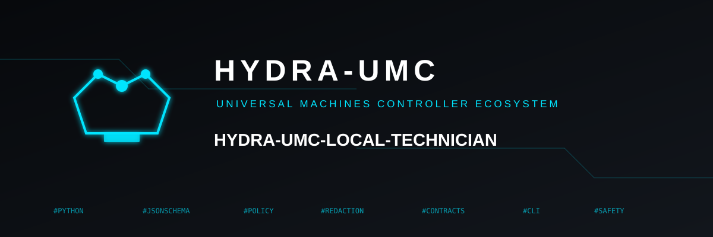

<p align="center">
  
</p>

# 🤖 HYDRA-UMC-LOCAL-TECHNICIAN

<p align="center"><a href="README.md">🇺🇸 English</a> | <a href="README_spa.md">🇪🇸 Español</a> | <a href="README_fra.md">🇫🇷 Français</a> | 🇮🇹 <b>Italiano</b> | <a href="README_deu.md">🇩🇪 Deutsch</a> | <a href="README_zho.md">🇨🇳 简体中文</a> | <a href="README_jpn.md">🇯🇵 日本語</a></p>

### 🛡️ Tecnico IA Locale con Permessi Controllati da Politica

<p align="center">
  
  
  
  
</p>

> **Stato: v0.0.2, funzionale - Fase 3 di 6, parziale (orchestratore di
> strumenti).** La Fase 0 ha definito la politica reale dei livelli
> di rischio (`policy/risk_levels.py`), una lista bianca fissa di
> strumenti (`policy/tool_matrix.py`), i cinque contratti minimi reali
> che ogni futura chiamata a uno strumento dovrà validare
> (`contracts/*.schema.json` + `contracts.py`), una reale redazione dei
> segreti portata dal già testato `log_redaction.py` di
> HYDRA-UMC-OPS-AGENT, e il criterio di uscita letterale della stessa
> Fase 0: un vero test avversariale che dimostra che un documento
> malevolo recuperato non può mai innescare una chiamata a uno strumento
> né rivelare un segreto. La Fase 3 collega 5 dei 9 strumenti OBSERVE
> dichiarati a un handler reale (`orchestrator/dispatch.py`):
> `service.status`, `storage.usage`, `network.port_status`,
> `system.temperature` e `manifest.read` - ciascuno risolve solo un nome
> simbolico in whitelist (`orchestrator/allowlist.py`), mai un
> percorso/host/porta grezzo che un documento recuperato potrebbe
> fornire. Non esistono ancora un motore di inferenza, un indice RAG,
> né un'integrazione con HYDRA-UMC-SERVER - vedi
> [docs/CLI_REFERENCE.md](docs/CLI_REFERENCE.md) per la superficie di
> comandi esatta che esiste oggi.

---

**Controllo di onestà - cosa funziona davvero oggi:** la policy dei livelli di rischio (`policy/risk_levels.py`), l'elenco fisso di strumenti consentiti (`policy/tool_matrix.py`), i cinque validatori di contratto (`contracts.py` + `contracts/*.schema.json`), il confine di difesa dalle injection (`knowledge/trust.py`, `knowledge/redaction.py`), e ora i primi 5 handler reali di strumenti OBSERVE (`orchestrator/dispatch.py` + `orchestrator/allowlist.py`: `service.status`, `storage.usage`, `network.port_status`, `system.temperature`, `manifest.read`) sono tutti reali e testati (85 test più 28 subtest superati tra `tests/unit/` e `tests/adversarial/`). Gli altri 4 strumenti in `TOOL_MATRIX` (`process.list`, `network.connectivity`, `update.pending`, `logs.read`) restano `implemented=False` di proposito - ciascuno richiede un proprio disegno separato (filtraggio, redazione, o una vera integrazione con HYDRA-UMC-UPDATER), non è una svista. Non esiste ancora alcun motore di inferenza, alcun indice RAG, né alcuna integrazione con HYDRA-UMC-SERVER in nessuna parte di questo repository - le Fasi 1, 2, 4 e 5 nella Roadmap più sotto restano interamente aspirazionali, senza alcun codice dietro, e la stessa Fase 3 è parziale (5 strumenti su 9). Vedi `CHANGELOG.md` per ciò che è stato consegnato esattamente finora.

---

## 1. 🛠️ PANORAMICA TECNICA

HYDRA-UMC-LOCAL-TECHNICIAN è un'IA locale specializzata per lo stesso
ecosistema HYDRA-UMC: osserva, spiega, diagnostica e propone
manutenzione per i servizi e i nodi dell'ecosistema stesso - non allena
mai un nuovo modello fondazionale, e non agisce mai generando testo. La
sua piattaforma target è la CM5, con l'acceleratore Hailo-10H una volta
installato, ma la Fase 0 non ha bisogno di nessuno dei due: tutto in
questa consegna è puro Python che valida dati puri.

**Principio non negoziabile:** l'IA non ottiene mai autorità generando
una risposta. La politica, i permessi e la conferma umana decidono ogni
azione reale - mai le parole stesse del modello.

Questa consegna (Fase 0) porta quattro pezzi reali e utili in modo
indipendente:

1. **Politica dei livelli di rischio** (`policy/risk_levels.py`) - sei
   livelli ordinati, da `INFORM` a `PHYSICAL_ACTION`, ognuno con una
   politica reale e testata (se può leggere uno strumento, se può
   mutare, se richiede conferma, se è implementato). I due livelli
   superiori sono dichiarati solo per completezza del contratto -
   davvero non implementati in nessuna parte di questo codice.
2. **Matrice degli strumenti** (`policy/tool_matrix.py`) - una lista
   bianca fissa di nove nomi reali di strumenti di livello `OBSERVE`. Un
   nome di strumento assente da questo dizionario non può mai essere
   chiamato, punto - e ogni nome presente ha ancora
   `implemented=False` in questa consegna.
3. **Contratti reali** (`contracts/*.schema.json` + `contracts.py`) -
   `ToolRequest`, `ToolResult`, `MaintenanceProposal`, `EvidenceBundle` e
   `PatchVerificationReport`, ciascuno con un file JSON Schema normativo
   e un validatore Python equivalente, solo stdlib, copiato da esso
   campo per campo.
4. **Confine di difesa contro l'injection** (`knowledge/trust.py` +
   `knowledge/redaction.py`) - il contenuto non affidabile (un README,
   una riga di log, un messaggio di commit) è sempre avvolto come
   `UntrustedText`, un tipo senza alcun metodo che possa mai produrre
   una chiamata a uno strumento. L'unico modo reale per costruire un
   `ToolRequest` prende campi già tipizzati e già separati, e rifiuta
   qualsiasi nome di strumento non registrato o non implementato prima
   ancora che l'oggetto esista.

```
$ hydra-umc-local-technician contracts validate tests/fixtures/tool_request.valid.json --contract ToolRequest
VALID: tests/fixtures/tool_request.valid.json (ToolRequest)

$ hydra-umc-local-technician contracts validate tests/fixtures/tool_request.invalid.json --contract ToolRequest
INVALID: tests/fixtures/tool_request.invalid.json (ToolRequest): ...
```

Non c'è invocazione di default/senza argomenti né interfaccia grafica in
questa consegna - vedi [docs/CLI_REFERENCE.md](docs/CLI_REFERENCE.md)
per la superficie di comandi reale e completa.

## 2. 🧱 ARCHITETTURA E DECISIONI DI PROGETTAZIONE

- **L'IA non ottiene mai autorità generando una risposta.** Ogni
  decisione di progettazione di questa consegna esiste per proteggere
  questo unico principio - vedi
  [docs/SECURITY_MODEL.md](docs/SECURITY_MODEL.md) per il modello
  completo.
- **Uno strumento deve essere registrato prima di poter mai essere
  chiamato.** `TOOL_MATRIX` di `policy/tool_matrix.py` è l'elenco
  completo e fisso; che `lookup_tool()` restituisca `None` è un rifiuto
  incondizionato, mai un caso in cui indovinare un livello di rischio
  predefinito.
- **Il contenuto non affidabile non può mai diventare un comando.** La
  difesa è architetturale (un tipo senza alcun metodo che produca uno
  strumento), non un filtro che tenta di riconoscere testo "simile a
  un'istruzione" - un gioco perso in partenza contro un'injection di
  prompt determinata. Vedi
  `tests/adversarial/test_injection_defense.py`, il criterio di uscita
  letterale della stessa Fase 0.
- **La fonte normativa di un contratto è il suo file JSON Schema.** Gli
  elenchi di campi e i validatori di `contracts.py` sono copiati da
  `contracts/*.schema.json`, campo per campo, seguendo la stessa
  convenzione di `validation.py` di HYDRA-UMC-SDK - non una seconda
  fonte di verità indipendente.
- **La redazione dei segreti riutilizza codice già testato.**
  `knowledge/redaction.py` è un porting byte per byte (cambia solo il
  commento di intestazione) del già testato `log_redaction.py` di
  HYDRA-UMC-OPS-AGENT - il problema di fondo (riconoscere forme reali e
  ben note di segreto senza un'euristica vaga) è identico qui.
- **`PRIVILEGED_CHANGE` e `PHYSICAL_ACTION` restano non implementati.**
  Una porta deliberata e permanente finché non esistano un design
  dedicato, un percorso di autorizzazione separato e, per l'azione
  fisica, veri interlock - non una svista da completare più avanti.
- **Questa consegna dichiara e valida soltanto - non agisce ancora.**
  Non esiste ancora un motore di inferenza, un indice RAG, una vera
  esecuzione di strumenti, né un'integrazione con HYDRA-UMC-SERVER in
  nessuna parte di questo repository.

## 📂 STRUTTURA DELLE DIRECTORY

```
HYDRA-UMC-LOCAL-TECHNICIAN/
├── src/hydra_umc_local_technician/
│   ├── policy/
│   │   ├── risk_levels.py    # RiskLevel + RiskLevelPolicy: i sei livelli, politica reale per livello
│   │   └── tool_matrix.py    # TOOL_MATRIX: la lista bianca fissa e reale di strumenti (9 nomi OBSERVE)
│   ├── knowledge/
│   │   ├── redaction.py      # Redazione reale dei segreti, portata da HYDRA-UMC-OPS-AGENT
│   │   └── trust.py          # UntrustedText + build_tool_request_from_model_output(): il confine di difesa contro l'injection
│   ├── contracts.py           # Validatore reale, solo stdlib, per i cinque contratti minimi
│   └── cli.py                 # Sottocomando contracts validate + --version
├── contracts/                  # File JSON Schema normativi (draft 2020-12) per i cinque contratti
├── tests/
│   ├── unit/                   # Test reali per ogni modulo sopra
│   ├── adversarial/            # test_injection_defense.py - il criterio di uscita letterale della stessa Fase 0
│   └── fixtures/                # Fixture JSON valide/non valide per ogni contratto
├── docs/
│   ├── ARCHITECTURE.md         # Scopo, i cinque pezzi target, architettura target, relazioni con l'ecosistema
│   ├── SECURITY_MODEL.md       # I sei livelli di rischio, regole dati/segreti, difesa contro l'injection
│   ├── CLI_REFERENCE.md        # contracts validate, flag, codici di uscita
│   └── CONTRACTS.md            # La forma reale, campo per campo, dei cinque contratti
├── images/                      # Media e icone dell'app
├── build.sh / build.bat        # venv + installazione editabile + verifica + test
├── build-test.sh / .bat        # Solo validazione di build non mutante
├── run.sh / run.bat            # Inoltra un comando CLI reale
├── bump_version.py             # Incremento "contachilometri" di tutto l'ecosistema (pyproject.toml + __init__.py)
└── bump_manifest_version.py    # Sincronizza la versione di hydra-umc.project.json con quella nativa (--sync)
```

## ⚙️ GUIDA ALLA COMPILAZIONE ED ESECUZIONE

```bash
chmod +x build.sh   # una sola volta
./build.sh          # crea .venv, pip install -e ".[dev]", verifica + test
./run.sh contracts validate tests/fixtures/tool_request.valid.json --contract ToolRequest
./run.sh --version
```

Su Windows: `build.bat`, poi `run.bat contracts validate ...` /
`run.bat --version`. `build-test.sh`/`.bat` esegue la stessa verifica di
sintassi Python non mutante che esegue già il workflow di CI di questo
progetto, senza toccare la versione del progetto né il CHANGELOG - NON
esegue la suite di test; esegui `./build.sh`/`build.bat` (o
`pytest tests/` direttamente) per la suite di test locale completa.

**Risoluzione dei problemi**

- `contracts validate` esce con codice `1` e `INVALID: ...`: leggi il
  messaggio - nomina il campo esatto e il motivo, non solo che qualcosa
  è fallito. Consulta [docs/CONTRACTS.md](docs/CONTRACTS.md) per la
  forma reale attesa di ciascuno dei cinque contratti.
- Un test in `tests/adversarial/` fallisce: è il criterio di uscita
  letterale della stessa Fase 0 - tratta ogni fallimento lì come una
  vera regressione del confine di difesa contro l'injection, mai come un
  test da allentare.

## 🚀 ROADMAP

Questa versione porta la Fase 0 e parte della Fase 3. Ciò che resta, in ordine di fase:

- **Fase 1 - Conoscenza recuperabile.** Un indice locale e versionato di
  documentazione, manifesti, contratti e runbook approvati - mai
  addestrato alla cieca su tutto il disco.
- **Fase 2 - Motore di inferenza locale.** Un piccolo LLM compatibile
  con Hailo-10H (candidati: Qwen2.5-1.5B-Instruct, Qwen2.5-Coder-1.5B,
  Qwen3-1.7B-Instruct), scelto solo dopo aver verificato la reale
  compatibilità Hailo, la latenza, la qualità linguistica, il consumo e
  la licenza.
- **Fase 3 - Orchestratore di strumenti (parziale: 5 su 9).** Codice
  deterministico che collega i primi gestori reali di strumenti di
  livello `OBSERVE` a `TOOL_MATRIX`, con la politica applicata a ogni
  chiamata. `service.status`, `storage.usage`, `network.port_status`,
  `system.temperature` e `manifest.read` sono già reali
  (`orchestrator/dispatch.py`); `process.list`, `network.connectivity`,
  `update.pending` e `logs.read` restano per una consegna successiva.
- **Fase 4 - Proposte e prove.** Generazione reale di
  `MaintenanceProposal` ed `EvidenceBundle`, con escalation verso il
  futuro ruolo di Developer Node di HYDRA-UMC-DEV-SERVER.
- **Fase 5 - Interfaccia utente.** Un'API locale integrata in
  HYDRA-UMC-SERVER/Studio, poi una CLI, poi la voce - senza mai aggirare
  i confini di politica e conferma già stabiliti dalla Fase 0.

Le Fasi 1, 2, 4 e 5 non esistono ancora in questo repository, e la
stessa Fase 3 è solo parzialmente fatta - vedi
[docs/ARCHITECTURE.md](docs/ARCHITECTURE.md) per ciò che ogni fase
include ed esclude esplicitamente, e
[docs/SECURITY_MODEL.md](docs/SECURITY_MODEL.md) per gli invarianti di
sicurezza che ogni fase deve continuare a rispettare.

## 🔗 Progetti Correlati

Questo progetto fa parte dell'ecosistema robotico HYDRA-UMC dello stesso autore (JuanenRac / Electro Hobby 3D). Utile da conoscere, poiché una richiesta potrebbe in realtà riguardare uno di questi anziché questo repository.

**Direttamente Correlati**
- **[HYDRA-UMC-COGNITIVE-NODE](https://github.com/JuanenRac/HYDRA-UMC-COGNITIVE-NODE)** — il genitore stesso di questo progetto: l'hub di integrazione della pipeline cognitiva Hailo-10 su cui girerà il futuro motore di inferenza di questo tecnico.
- **[HYDRA-UMC-OPS-AGENT](https://github.com/JuanenRac/HYDRA-UMC-OPS-AGENT)** — proprietario del ciclo di vita degli incidenti di manutenzione (prova, diagnosi, cambiamento approvato da un umano, deploy canary, verifica); il proprio `knowledge/redaction.py` di questo tecnico è un porting diretto del suo già testato `log_redaction.py`, e una fase futura fa l'escalation di veri pacchetti di prove verso di esso, senza mai aggirare il proprio flusso di approvazione.
- **[HYDRA-UMC-DEV-SERVER](https://github.com/JuanenRac/HYDRA-UMC-DEV-SERVER)** — il futuro Developer Node a cui una fase successiva invierà un `EvidenceBundle` reale per lo studio, il test e la preparazione di una patch revisionata - mai un canale diretto e automatico di patching.
- **[HYDRA-UMC-SDK](https://github.com/JuanenRac/HYDRA-UMC-SDK)** — definirà i contratti condivisi e versionati con cui i propri `contracts/*.schema.json` locali di questo progetto sono pensati per riconciliarsi, una volta che esisteranno anche lì.
- **[HYDRA-UMC-SERVER](https://github.com/JuanenRac/HYDRA-UMC-SERVER)** — il futuro punto di ingresso autenticato che ospiterà il proprio endpoint, sessioni, ruoli e traccia di audit di questo tecnico.

**Anche Parte dell'Ecosistema**

*Nucleo Hardware e Piattaforma*
- **[HYDRA-UMC](https://github.com/JuanenRac/HYDRA-UMC)** — la scheda madre fisica del braccio robotico: host CM5 + STM32H745 dual-core, che orchestra fino a 8 bracci-utensile via CAN-OTA/SPI-OTA.
- **[HYDRA-UMC-OS](https://github.com/JuanenRac/HYDRA-UMC-OS)** — strato prodotto riproducibile di Raspberry Pi OS per la CM5: agente in sola lettura, config/profili validati, provisioning WiFi al primo contatto.

*Backend Principale e Client*
- **[HYDRA-UMC-SERVER](https://github.com/JuanenRac/HYDRA-UMC-SERVER)** — il vero backend headless (REST/WebSocket) con cui parla davvero ogni client di controllo.
- **[HYDRA-UMC-STUDIO](https://github.com/JuanenRac/HYDRA-UMC-STUDIO)** — dashboard di controllo web con visualizzazione 3D multi-robot in tempo reale.
- **[HYDRA-UMC-SUITE](https://github.com/JuanenRac/HYDRA-UMC-SUITE)** — centro di comando desktop (PySide6) per più server contemporaneamente.
- **[HYDRA-UMC-ANDROID-CONTROL](https://github.com/JuanenRac/HYDRA-UMC-ANDROID-CONTROL)** — app di controllo Android nativa con login biometrico e un companion Wear OS abbinato.
- **[HYDRA-UMC-IOS-CONTROL](https://github.com/JuanenRac/HYDRA-UMC-IOS-CONTROL)** — app di controllo iOS/iPadOS (Flutter) con sincronizzazione WebSocket in tempo reale.
- **[HYDRA-UMC-DSI](https://github.com/JuanenRac/HYDRA-UMC-DSI)** — interfaccia touch nativa per lo schermo DSI da 7" a bordo, integrata direttamente sulla CM5.
- **[HYDRA-UMC-EDITOR-URDF](https://github.com/JuanenRac/HYDRA-UMC-EDITOR-URDF)** — creatore/editor grafico desktop di URDF che carica i modelli finiti nel catalogo di STUDIO.
- **[HYDRA-UMC-BRIDGE-AMR](https://github.com/JuanenRac/HYDRA-UMC-BRIDGE-AMR)** — confine di coordinamento per flotte AGV/AMR tramite un vero publisher MQTT VDA 5050.
- **[HYDRA-UMC-BRIDGE-CNC](https://github.com/JuanenRac/HYDRA-UMC-BRIDGE-CNC)** — coordinatore di cella CNC di alto livello con accesso reale a stato/byte di controllo GRBL.
- **[HYDRA-UMC-BRIDGE-DROIDS](https://github.com/JuanenRac/HYDRA-UMC-BRIDGE-DROIDS)** — confine di coordinamento per droidi con zampe/umanoidi, con un vero mittente di comandi Boston Dynamics Spot.
- **[HYDRA-UMC-BRIDGE-LASER](https://github.com/JuanenRac/HYDRA-UMC-BRIDGE-LASER)** — coordinatore di sicurezza di cella laser che legge 3 vere protezioni GPIO chiave/recinto/interlock.
- **[HYDRA-UMC-BRIDGE-OPENPNP](https://github.com/JuanenRac/HYDRA-UMC-BRIDGE-OPENPNP)** — coordinatore sicuro di alto livello del flusso schede per pick-and-place OpenPnP.
- **[HYDRA-UMC-BRIDGE-PRINTER3D](https://github.com/JuanenRac/HYDRA-UMC-BRIDGE-PRINTER3D)** — confine di coordinamento sicuro per stampanti 3D Moonraker/Klipper, con comandi di lavoro realmente controllati.
- **[HYDRA-UMC-BRIDGE-ROS2](https://github.com/JuanenRac/HYDRA-UMC-BRIDGE-ROS2)** — coordinatore di sicurezza con un vero trasporto ROS 2 rclpy, importato in modo lazy.
- **[HYDRA-UMC-BRIDGE-UAV](https://github.com/JuanenRac/HYDRA-UMC-BRIDGE-UAV)** — confine di coordinamento per UAV dotati di telecamera, con un vero mittente di comandi MAVLink.

*Piattaforma Strumenti URTC*
- **[URTC](https://github.com/JuanenRac/URTC)** — firmware per la scheda fisica Universal Robot Tool Controller, 25+ profili strumento su bus CAN.
- **[URTC-FLASHER](https://github.com/JuanenRac/URTC-FLASHER)** — strumento grafico desktop per flashare schede URTC, CAN-OTA più SWD/JTAG a chip completo.
- **[URTC-TESTER](https://github.com/JuanenRac/URTC-TESTER)** — strumento di diagnostica CAN dal vivo desktop per schede URTC, un pannello per profilo strumento.
- **[URTC-WEB-STUDIO](https://github.com/JuanenRac/URTC-WEB-STUDIO)** — alternativa da browser a URTC-TESTER via Web Serial API, senza installazione locale.

*Nodo di Visione IA (Hailo-8)*
- **[HYDRA-UMC-VISION-NODE](https://github.com/JuanenRac/HYDRA-UMC-VISION-NODE)** — hub di integrazione della pipeline di visione Hailo-8, con una verifica reale di prontezza hardware per fase.
- **[HYDRA-UMC-DETECTION-HEF](https://github.com/JuanenRac/HYDRA-UMC-DETECTION-HEF)** — registro reale di modelli compilati con verifica di caricamento sicuro per architettura/checksum Hailo.
- **[HYDRA-UMC-VISION-STREAMER](https://github.com/JuanenRac/HYDRA-UMC-VISION-STREAMER)** — pipeline GStreamer reale + generatore di config MediaMTX con un vero confine di integrazione HailoRT.
- **[HYDRA-UMC-VISUAL-SERVOING-API](https://github.com/JuanenRac/HYDRA-UMC-VISUAL-SERVOING-API)** — legge di correzione reale di servocontrollo visivo basato sulla posizione, con gate di sicurezza secondo lo stato della zona.
- **[HYDRA-UMC-SAFETY-ZONES](https://github.com/JuanenRac/HYDRA-UMC-SAFETY-ZONES)** — verifica reale di intrusione di zona e richiesta di E-STOP, con imposizione di freschezza della calibrazione.

*Nodo Cognitivo IA (Hailo-10)*
- **[HYDRA-UMC-VLA-ENGINE](https://github.com/JuanenRac/HYDRA-UMC-VLA-ENGINE)** — codifica/decodifica reale di action-token e generazione di traiettoria per un modello Visione-Linguaggio-Azione.
- **[HYDRA-UMC-VOICE-UI](https://github.com/JuanenRac/HYDRA-UMC-VOICE-UI)** — front-end vocale reale (VAD + parser di intenti) con un relay verso Watch limitato e con conferma.
- **[HYDRA-UMC-SEMANTIC-PLANNER](https://github.com/JuanenRac/HYDRA-UMC-SEMANTIC-PLANNER)** — scomposizione di compiti reale basata su regole e recupero semantico degli errori sui codici di errore MCU.
- **[HYDRA-UMC-DOCS-QA](https://github.com/JuanenRac/HYDRA-UMC-DOCS-QA)** — ricerca documentale reale TF-IDF solo stdlib sulla propria documentazione Markdown di questo ecosistema.

*Orchestrazione e Sciame*
- **[HYDRA-UMC-ORCHESTRATOR](https://github.com/JuanenRac/HYDRA-UMC-ORCHESTRATOR)** — hub di integrazione con un vero contratto di report di salute gRPC/Protobuf e macchina a stati di missione.
- **[HYDRA-UMC-JOB-DISPATCHER](https://github.com/JuanenRac/HYDRA-UMC-JOB-DISPATCHER)** — coda di lavori reale basata su priorità con deduplicazione, su una vera API HTTP.
- **[HYDRA-UMC-NODE-HEALING](https://github.com/JuanenRac/HYDRA-UMC-NODE-HEALING)** — vero watchdog di salute della flotta basato su gRPC, con proprio retry/backoff e rilevamento di discrepanza di identità.
- **[HYDRA-UMC-PATH-PLANNER-3D](https://github.com/JuanenRac/HYDRA-UMC-PATH-PLANNER-3D)** — pianificatore reale di traiettoria 3D basato su RRT con validazione reale di collisione ostacoli/spazio di lavoro.
- **[HYDRA-UMC-SWARM-SYNC](https://github.com/JuanenRac/HYDRA-UMC-SWARM-SYNC)** — sincronizzazione di stato CRDT LWW-Element-Map reale, testata per proprietà per la convergenza multi-cella.

*Gemello Digitale e Simulazione*
- **[HYDRA-UMC-TWIN](https://github.com/JuanenRac/HYDRA-UMC-TWIN)** — hub di integrazione del motore di gemello digitale, con un vero contratto di sincronizzazione di compatibilità delle versioni.
- **[HYDRA-UMC-HIL-BRIDGE](https://github.com/JuanenRac/HYDRA-UMC-HIL-BRIDGE)** — interlock di sicurezza reale hardware-in-the-loop che instrada comandi tra simulazione e hardware reale.
- **[HYDRA-UMC-PHYSICS-REPLICA](https://github.com/JuanenRac/HYDRA-UMC-PHYSICS-REPLICA)** — cinematica diretta reale e validazione dei limiti di giunto su un sottoinsieme URDF reale.
- **[HYDRA-UMC-SYNTHETIC-DATA-GEN](https://github.com/JuanenRac/HYDRA-UMC-SYNTHETIC-DATA-GEN)** — generatore procedurale reale di scene 2D con esportazione di annotazioni YOLO/COCO.

*Dati e Analisi*
- **[HYDRA-UMC-DATALAKE](https://github.com/JuanenRac/HYDRA-UMC-DATALAKE)** — archivio reale di serie temporali con sqlite3 e una vera API HTTP di ingestione/query.
- **[HYDRA-UMC-ANOMALY-DETECTOR](https://github.com/JuanenRac/HYDRA-UMC-ANOMALY-DETECTOR)** — rilevatore di anomalie reale via FFT + baseline statistica, con monitoraggio della deriva.
- **[HYDRA-UMC-PRODUCTION-REPORTS](https://github.com/JuanenRac/HYDRA-UMC-PRODUCTION-REPORTS)** — calcolo reale di OEE/disponibilità sullo storico DATALAKE, con esportazione CSV riproducibile.
- **[HYDRA-UMC-TELEMETRY-COLLECTOR](https://github.com/JuanenRac/HYDRA-UMC-TELEMETRY-COLLECTOR)** — pipeline reale di ingestione CAN/WebSocket verso DATALAKE, con deduplicazione di sequenza.

*Gateway Industriale*
- **[HYDRA-UMC-GATEWAY-INDUSTRIAL](https://github.com/JuanenRac/HYDRA-UMC-GATEWAY-INDUSTRIAL)** — hub di integrazione che si collega a protocolli industriali, con un vero strato di lista bianca di comandi/backpressure.
- **[HYDRA-UMC-OPCUA-SERVER](https://github.com/JuanenRac/HYDRA-UMC-OPCUA-SERVER)** — spazio di indirizzamento OPC-UA reale, verificato con una vera sessione client di protocollo binario.
- **[HYDRA-UMC-MQTT-BROKER](https://github.com/JuanenRac/HYDRA-UMC-MQTT-BROKER)** — broker MQTT reale con autenticazione opzionale per client e ACL sui topic.
- **[HYDRA-UMC-MTCONNECT-ADAPTER](https://github.com/JuanenRac/HYDRA-UMC-MTCONNECT-ADAPTER)** — veri endpoint XML `/probe` e `/current` MTConnect con output in modalità degradata.

*Strumenti Complementari*
- **[HYDRA-UMC-DASHBOARD-AI](https://github.com/JuanenRac/HYDRA-UMC-DASHBOARD-AI)** — pannelli di Riepiloghi Intelligenti ed Evidenziazione Anomalie su DATALAKE/ANOMALY-DETECTOR, con un fallback statistico onesto.
- **[HYDRA-UMC-TOOL-CLI](https://github.com/JuanenRac/HYDRA-UMC-TOOL-CLI)** — CLI di flotta con un vero e stabile contratto di codici di uscita, un client reale e dal vivo della propria API di HYDRA-UMC-SERVER.
- **[HYDRA-UMC-WATCH](https://github.com/JuanenRac/HYDRA-UMC-WATCH)** — app companion WearOS con vere notifiche aptiche e un relay vocale al telefono abbinato.
- **[HYDRA-UMC-CONNECTOR-HUB](https://github.com/JuanenRac/HYDRA-UMC-CONNECTOR-HUB)** — catalogo di capacità di adattatori esterni, solo GET per progettazione.
- **[HYDRA-UMC-OS-REBUILDER](https://github.com/JuanenRac/HYDRA-UMC-OS-REBUILDER)** — costruisce un'immagine fresca della CM5 dal sorgente, un altro fratello di "Ecosystem Operations".
- **[URTC-SMART-RACK](https://github.com/JuanenRac/URTC-SMART-RACK)** — firmware per un rack di montaggio schede con decodifica reale dell'ID strumento e logica di preriscaldamento Smart Idle.
- **[URTC-VISION-TOOL](https://github.com/JuanenRac/URTC-VISION-TOOL)** — firmware più un vero companion di visione Python per una testa di ispezione termica/RGB.

---

## 📚 Documentazione e Comunità

- **[docs/ARCHITECTURE.md](docs/ARCHITECTURE.md)** — scopo, i cinque pezzi target, architettura target, e relazioni con l'ecosistema.
- **[docs/SECURITY_MODEL.md](docs/SECURITY_MODEL.md)** — i sei livelli di rischio, regole dati/segreti, e il vero confine testato di difesa contro l'injection.
- **[docs/CLI_REFERENCE.md](docs/CLI_REFERENCE.md)** — ogni sottocomando, i suoi flag, e il contratto di codici di uscita.
- **[docs/CONTRACTS.md](docs/CONTRACTS.md)** — la forma reale, campo per campo, dei cinque contratti.
- **[CONTRIBUTING.md](CONTRIBUTING.md)** — stack tecnico e linee guida di codifica per una pull request.
- **[CODE_OF_CONDUCT.md](CODE_OF_CONDUCT.md)** — gli standard di comportamento attesi in questa comunità.
- **[SECURITY.md](SECURITY.md)** — come segnalare una vulnerabilità, e le vere aree di focus di sicurezza di questo progetto.
- **[SUPPORT.md](SUPPORT.md)** — dove fare domande e segnalare bug.

## 👤 AUTORE
**JuanenRac** (Electro Hobby 3D)
📧 electrohobby3d@gmail.com
📺 [youtube.com/@electrohobby3d](https://youtube.com/@electrohobby3d)

## 📜 LICENZA

GPL-3.0 (software) / CC BY-SA 4.0 (documentazione) - vedi [LICENSE.md](LICENSE.md).
